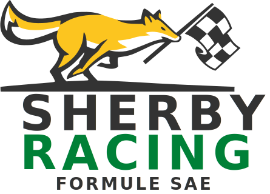

# Sherby Racing

### **Site web officiel de Sherby Racing, l'équipe Formule SAE de l'Université de Sherbrooke.**

---

## À propos

Sherby Racing conçoit et fabrique une monoplace de course dans le cadre de la compétition internationale **Formule SAE Michigan**. En 2025, l'équipe s'est classée **1re au Canada** et **12e au Michigan** sur 120 équipes avec son véhicule à combustion interne. Le prochain chapitre met l'accent sur la conception du premier véhicule entièrement électrique de l'équipe pour 2027.

---

## Faculté de génie - Université de Sherbrooke

### Sherby Racing

**Juin 2026**

 

